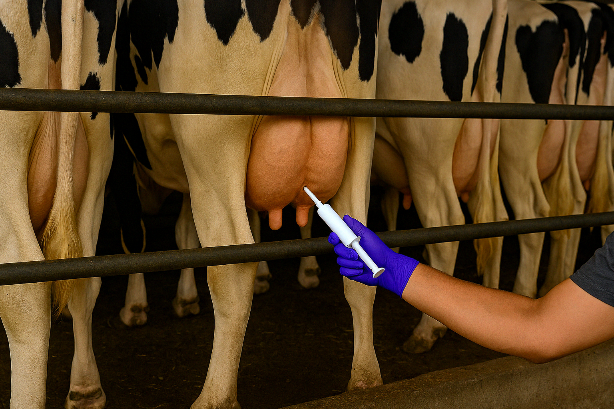

***

Research has shown that selective dry cow therapy (DCT) can be implemented in well-managed dairy farms without negatively affecting postpartum udder health and performance. This raises the question of whether DCT is necessary in well-managed farms. Our primary objective was to assess the impact of withholding intramammary antibiotics in cows at the end of their first lactation on postpartum quarter-level intramammary infections (IMI) prevalence. Our secondary objective was to evaluate the impact of intramammary antibiotics omission at dry-off on postpartum quarter-level IMI prevalence in subgroups of quarters, stratified by quarter-level somatic cell count (SCC) and California mastitis test (CMT) results at dry-off. Our third objective was to model, based on our data, the potential effect of SCC- and CMT-guided selective DCT programs on antibiotic use and udder health. 
 

